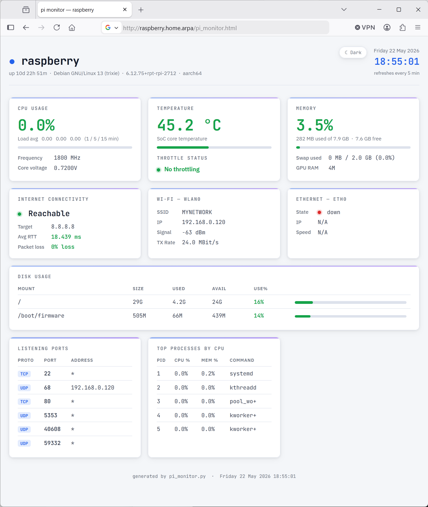
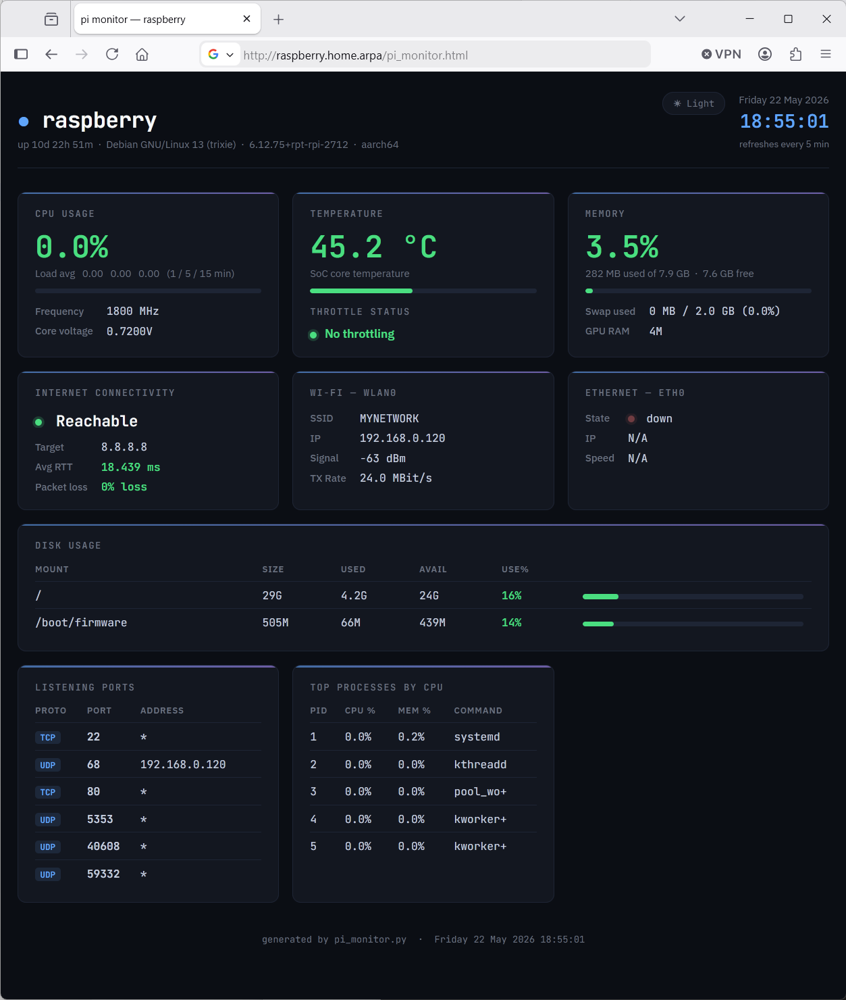

# pi-monitor

A single-file Python script (`pi-monitor.py`) that generates a static HTML health dashboard for a Raspberry Pi. Run it on a cron schedule and serve the output with any web server.

## Screenshots

### Light mode:



### Dark mode:



## Requirements

- Python 3.7+
- Standard library only — no pip dependencies
- Optional: `iw` for Wi-Fi stats, `vcgencmd` for temperature/throttle/voltage (Raspberry Pi firmware tool)

## Usage

```bash
# Write to the default location (same directory as the script)
python3 pi_monitor.py

# Write to a different location
python3 /home/pi/pi_monitor.py --output /var/www/html/index.html

# Enable optional status panels
python3 /home/pi/pi_monitor.py --tailscale
python3 pi_monitor.py --docker
python3 pi_monitor.py --dagu --dagu-url http://localhost:8080 --dagu-token <token>

# See all options
python3 pi_monitor.py --help
```

### Command-line options

| Option | Default | Description |
|---|---|---|
| `--output`, `-o` | `pi_monitor.html` next to the script | Where to write the HTML file |
| `--ping-host` | `8.8.8.8` | Host to ping for the connectivity check |
| `--ping-count` | `4` | Number of ping packets to send |
| `--tailscale` | off | Enable the Tailscale status panel |
| `--tailscale-container` | `tailscale` | Docker container name to query when native `tailscale` is not found |
| `--dagu` | off | Enable the Dagu status panel |
| `--dagu-url` | `http://localhost:8080` | Base URL of the local Dagu instance |
| `--dagu-token` | | Bearer token for Dagu API authentication |
| `--docker` | off | Enable Docker status panel. Note: the user running the script must be in the `docker` group |

### Cron setup

```cron
*/5 * * * * /usr/bin/python3 /home/pi/pi_monitor.py --output /var/www/html/index.html > /dev/null
```

The generated page auto-refreshes every 5 minutes to match.

## What it monitors

### Core

- **System info** — hostname, uptime, OS, kernel, architecture
- **CPU** — usage %, load average (1/5/15 min), frequency, core voltage
- **Temperature** — SoC temperature with throttle status and active throttle flags
- **Memory** — used/available RAM and swap
- **Connectivity** — public IP, ping RTT and packet loss to `PING_HOST`
- **Ethernet** — state, speed and IP (if your Pi has an Ethernet port)
- **Wi-Fi** — SSID, signal, TX rate and IP
- **Disks** — usage for all non-virtual mounts
- **Listening ports** — TCP/UDP ports read from `/proc/net` (no root required)
- **Top processes** — top 5 by CPU usage

### Optional

- **Tailscale** — VPN state, Tailscale IP/DNS, peer count, active peers, and relay breakdown
- **Docker** - Container state
- **Dagu** - Status of runs in last 24hrs

## Output

A self-contained HTML file with light/dark mode toggle (preference persisted in `localStorage`). The only external resource is the Google Fonts stylesheet.

The page degrades gracefully: any metric that cannot be collected (e.g. `vcgencmd` not available, Docker not accessible, Dagu unreachable) shows an error message in the relevant card rather than crashing the script.

## Serving the output

Any static file server works. A minimal option using Python itself:

```bash
python3 -m http.server 8080 --directory /var/www/html
```

Or with nginx:

```nginx
server {
    listen 80;
    root /var/www/html;
    index index.html;
}
```

## Developing

A VS Code devcontainer and `Makefile` are included to make it easy to work on the script without a physical Pi.

### Devcontainer

Open the repo in VS Code and choose **Reopen in Container**. The container provides Python, Pylance, and Ruff, plus a stub `vcgencmd` so the script runs on non-Pi hardware.

### Makefile

```bash
make serve   # generates the HTML and serves it at http://localhost:8080
make clean   # removes the output directory
```
